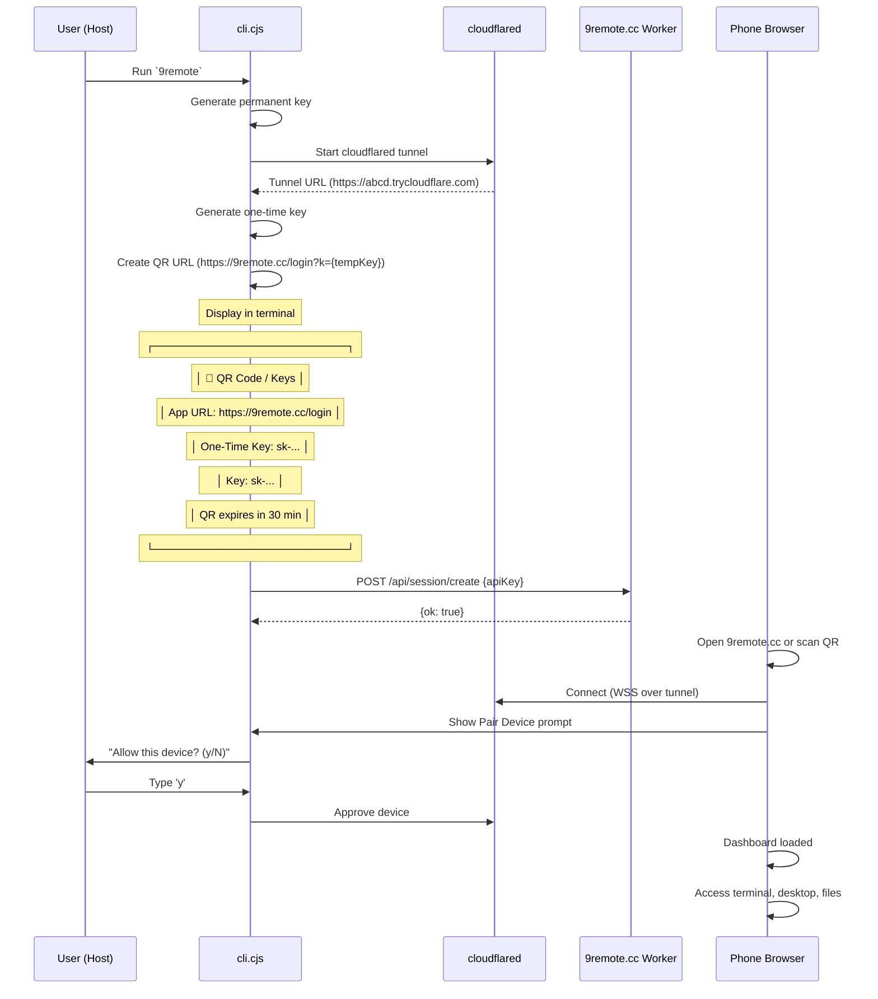

# First Run & Onboarding Flow

> **Purpose:** Document the first-run experience and device pairing flow.
> **Scope:** Key generation, QR login, device pairing, initial setup.
> **Source:** `package/dist/cli.cjs`, `README.md`

## 1. Overview

When a user runs 9Remote for the first time (or on subsequent runs), the following sequence occurs:

1. Generate/permanent key from machine ID
2. Start Cloudflare tunnel
3. Generate one-time key for QR login
4. Display QR code / keys in terminal
5. User scans QR with phone or enters key manually
6. Device pairing approval (Pair Device)
7. Connection established

## 2. First Run Key Generation

### 2.1 Permanent Key

```mermaid
flowchart TD
    A[First Run] --> B[Get machine ID]
    B --> C[SHA256 hash + salt]
    C --> D[Generate key ID + random + HMAC]
    D --> E[Format: sk-{id8}-{rand4}-{hmac6}]
    E --> F[Save to ~/.9remote/keys.json]
```

**Machine ID Sources:**
| Platform | Command |
|----------|--------|
| macOS | `ioreg -rd1 -c IOPlatformExpertDevice` |
| Linux | `/var/lib/dbus/machine-id` or `/etc/machine-id` or `hostname` |
| Windows | `REG.exe QUERY HKLM\SOFTWARE\Microsoft\Cryptography /v MachineGuid` |

**Key Format Breakdown:**
```
sk-9f3a2b1c-d4e5-f6a7b8c9d0e1f2
│   │        │    │
│   │        │    └─── HMAC-SHA256 (6 chars)
│   │        └──────── Random 4 chars [a-z0-9]
│   └───────────────── First 8 of SHA256(machineId + salt)
└───────────────────── Prefix "sk-"
```

### 2.2 One-Time Key

For each session, a one-time key is generated:

```javascript
function generateOneTimeKey(permanentKey) {
  const keyId = permanentKey.slice(0, 8);  // First 8 chars
  const random = randomString(4);           // 4 random chars
  const hmac = hmacSha256(keyId + random, API_KEY_SECRET).slice(0, 6);
  return `sk-${keyId}-${random}-${hmac}`;
}
```

- **Expiry:** 30 minutes (1,800,000ms)
- **Stored:** In server state (state.json) and SSE state
- **Usage:** Single use — cleared after being consumed
- **Regeneration:** Available from TUI menu: `Keys → Regenerate`

## 3. QR Login Flow



## 4. QR Code Display

### In TUI Mode

The CLI displays the QR code directly in the terminal using `qrcode-terminal`:

```
🔑 Scan QR to connect:

⣾⣽⣻⢿⡿⣟⣻⣽⣾⣷⣧⣷⣶⣾⣶⣧⣷⣧⣷⣶⣾⣶⣧⣷⣧⣷⣶⣾⣶⣧
⣿⣿⣿⣿⣿⣿⣿⣿⣿⣿⣿⣿⣿⣿⣿⣿⣿⣿⣿⣿⣿⣿⣿⣿⣿⣿⣿⣿⣿
⣟⣻⣽⣾⣿⣿⣿⣿⣿⣿⣿⣿⣿⣿⣿⣿⣿⣿⣿⣿⣿⣿⣿⣿⣿⣿⣿⣿⣿
⠻⢿⡿⣟⣻⣽⣾⣶⣧⣷⣶⣧⣷⣶⣧⣷⣶⣧⣷⣶⣧⣷⣶⣧⣷⣶⣧⣷⣶
⣽⣾⣿⣿⣿⣿⣿⣿⣿⣿⣿⣿⣿⣿⣿⣿⣿⣿⣿⣿⣿⣿⣿⣿⣿⣿⣿⣿⣿
⣿⣿⣿⣿⣿⣿⣿⣿⣿⣿⣿⣿⣿⣿⣿⣿⣿⣿⣿⣿⣿⣿⣿⣿⣿⣿⣿⣿⣿
⠛⠛⠛⠛⠛⠛⠛⠛⠛⠛⠛⠛⠛⠛⠛⠛⠛⠛⠛⠛⠛⠛⠛⠛⠛⠛⠛⠛⠛⠛⠛

QR expires in 30 minutes (one-time use)
App URL: https://9remote.cc/login
One-Time Key: sk-abcd1234-efgh-ijklmn
Key: sk-abcd1234-ijkl-mnopqr
```

### In Web UI Mode

The QR code is rendered inline as a canvas/SVG in the browser dashboard. The phone can either:
- Scan with the mobile app's camera
- Use the QR scanner in the web UI
- Paste the one-time key manually

## 5. Pair Device Approval

### 5.1 Approval Prompt

When a new device connects, the host sees:

```
🔔 New Device Connection

  Device: ABCD12...  (first 8 chars of device ID)
  IP:      192.168.1.100

  Allow this device? (y/N):
```

### 5.2 TUI Key Prompt (Ii function)

The prompt is implemented as a full-screen TUI:

```
══════════════════════════════════
  🔔 New Device Connection
══════════════════════════════════
  Device:  ABCD1234...
  IP:      192.168.1.100
══════════════════════════════════

  Allow this device?  (y/N)

  y  →  ✓ Device approved
  n  →  ✗ Device rejected
```

### 5.3 Approval Outcomes

| Action | Result |
|--------|--------|
| `y` / `Enter` | Device approved, connection continues |
| `n` / `Esc` | Device rejected, connection blocked |
| `Ctrl+C` | Exit without approving, device remains pending |
| Timeout (30s) | Device rejected automatically |

### 5.4 Auto-Approve

Auto-approval can be enabled:
- **TUI menu:** `Devices → Auto-approve new devices`
- **Web UI:** Settings → Devices → Auto-approve
- **API:** `POST /api/device/auto-approve { enabled: true }`

When enabled, all new connections are automatically approved without prompting.

## 6. Subsequent Runs

On subsequent runs (not first run):

1. **Load existing keys:** Read `~/.9remote/keys.json` — no regeneration needed
2. **Start tunnel:** Same as first run
3. **Generate new one-time key:** Fresh 30-minute key
4. **Display QR/keys:** Same as first run
5. **Pair Device:** New devices still need approval (unless auto-approved)

**Note:** The permanent key is tied to the machine. If the machine ID changes (e.g., fresh OS install), a new permanent key is generated.
