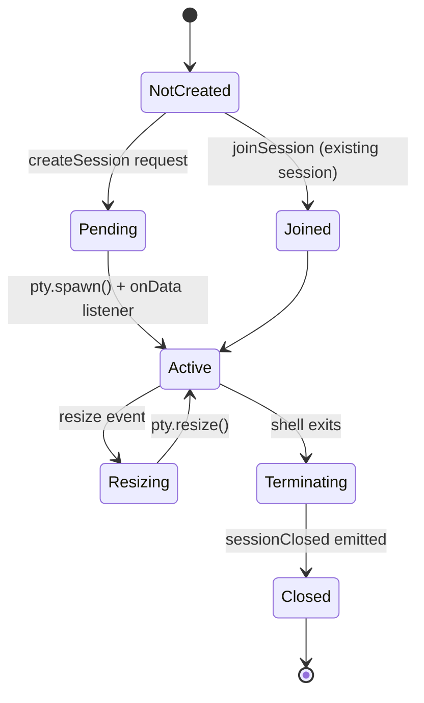
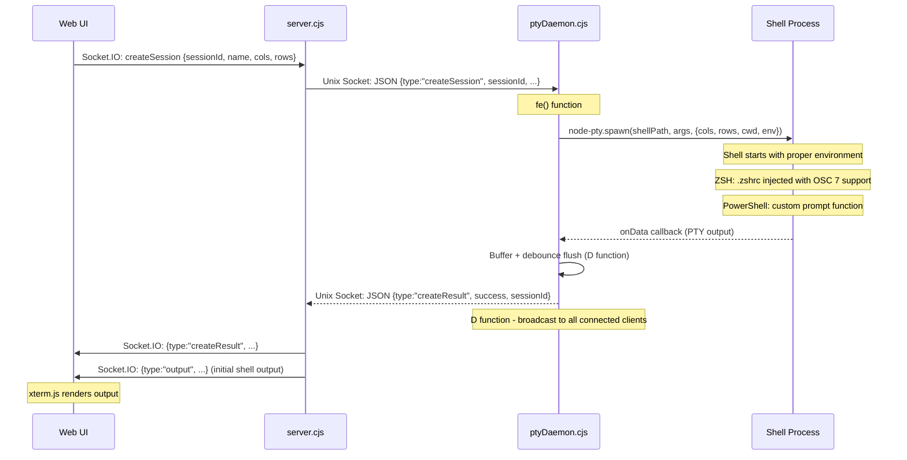
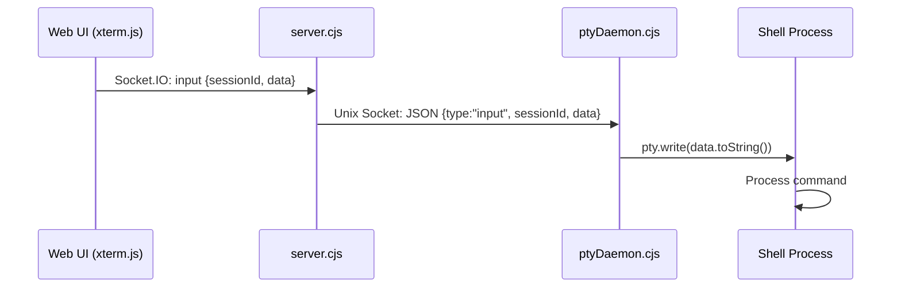
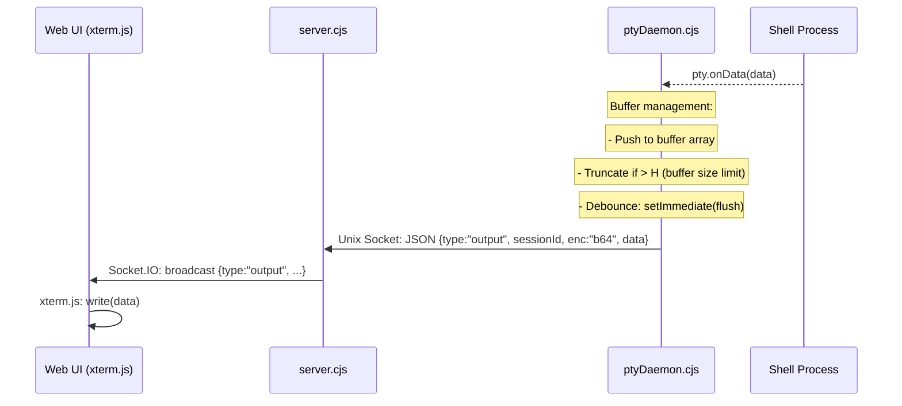
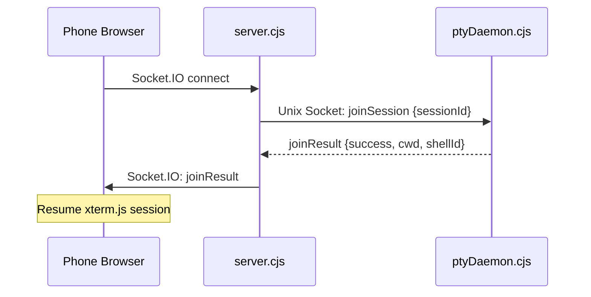
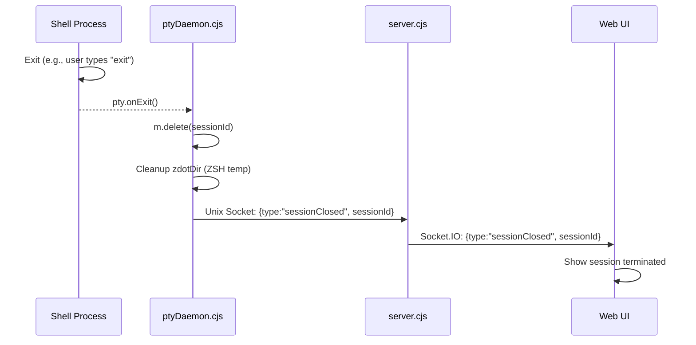
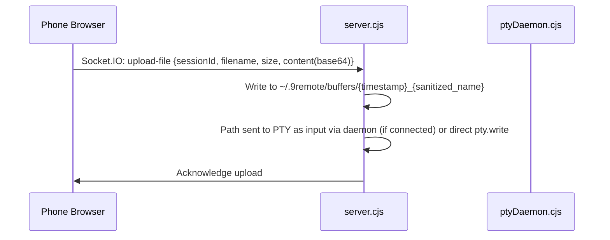

# PTY Session Lifecycle

> **Purpose:** Document the lifecycle of PTY (pseudo-terminal) sessions in 9Remote.
> **Scope:** Session creation, joining, input/output flow, resizing, and termination.
> **Source:** `package/dist/ptyDaemon.cjs`, `package/dist/server.cjs`

## 1. Overview

9Remote manages persistent PTY sessions through a dedicated daemon process (`ptyDaemon.cjs`). This daemon:
- Survives server restarts (sessions persist even if the HTTP server goes down)
- Communicates with the server via a Unix domain socket (or Windows named pipe)
- Uses `node-pty` to spawn shell processes
- Implements a custom JSON-over-socket protocol (version "46")

## 2. Architecture

```
┌─────────────────────────────────────────────────────────────┐
│  Web UI (Browser)                                            │
│  ├── xterm.js (terminal emulator)                           │
│  └── Socket.IO client                                        │
└──────────────┬───────────────────────────────────────────────┘
               │ Socket.IO (WebSocket)
               ▼
┌─────────────────────────────────────────────────────────────┐
│  Server (server.cjs, port 2208)                             │
│  ├── Socket.IO server (forwards events)                     │
│  ├── PtyDaemon client (Unix socket)                        │
│  └── API + SSE (state management)                          │
└──────────────┬──────────────────────────────────────────────┘
               │ Unix Socket (newline-delimited JSON)
               ▼
┌─────────────────────────────────────────────────────────────┐
│  PtyDaemon (ptyDaemon.cjs)                                   │
│  ├── Socket server: ~/.9remote/pty-daemon.sock              │
│  │   (Windows: \\.\pipe\9remote-pty)                        │
│  ├── Session pool: Map<string, SessionInfo>                 │
│  ├── node-pty (shell spawn)                                 │
│  ├── OSC 7 CWD tracking                                     │
│  └── Output buffer management                               │
└──────────────┬───────────────────────────────────────────────┘
               │ PTY (pseudo-terminal)
               ▼
┌─────────────────────────────────────────────────────────────┐
│  Shell Process (bash/zsh/pwsh/cmd)                          │
└─────────────────────────────────────────────────────────────┘
```

## 3. Session Lifecycle States



## 4. Session Creation Flow



## 5. Input Flow



### Input Handling Details

- **Terminal input:** Sent as UTF-8 strings
- **Special keys:** Arrow keys, Ctrl combinations handled by xterm.js
- **Paste events:** Base64 or string data
- **AI agent integration:** Special handling for Claude Code / Codex sessions via `session-resume` event

## 6. Output Flow



### Output Buffer Management

```javascript
// N() function - buffer concatenation and truncation
const concatenateBuffers = (buffers, maxSize) => {
  if (!buffers?.length || maxSize <= 0) return Buffer.alloc(0);
  let remaining = maxSize;
  const chunks = [];
  for (let i = buffers.length - 1; i >= 0 && remaining > 0; i--) {
    const buf = buffers[i];
    if (buf.length <= remaining) {
      chunks.push(buf);
      remaining -= buf.length;
    } else {
      chunks.push(buf.subarray(buf.length - remaining));
      remaining = 0;
    }
  }
  chunks.reverse();
  const result = Buffer.concat(chunks);
  // Strip leading ANSI sequences if truncated
  return result;
};
```

### CWD Tracking

The daemon tracks working directory changes by parsing OSC 7 escape sequences:

```
OSC 7 format: \e]7;file://host/path\x07
```

- **ZSH:** `.zshrc` injected with `NineRemoteOsc7()` precmd function
- **Bash:** `PROMPT_COMMAND` modified to emit OSC 7
- **PowerShell:** Custom prompt function emits OSC 7

When a CWD change is detected, the daemon emits a `cwdChange` event.

## 7. Session Join Flow

When a phone connects and joins an existing session:



## 8. Session Termination

### Normal Exit (shell exits naturally)



### Forced Termination

- Server can send `deleteSession` via Unix socket
- PtyDaemon responds by killing the PTY process: `pty.kill()`
- Session is removed from the session pool

## 9. Supported Shells

| Platform | Shell | Path | Args |
|----------|-------|------|------|
| macOS/Linux | bash | `/bin/bash` | `["-l"]` (login shell) |
| macOS/Linux | zsh | `/bin/zsh` | `["-l"]` |
| macOS/Linux | sh | `/bin/sh` | `["-l"]` |
| macOS/Linux | $SHELL (fallback) | `$SHELL` (path) | `["-l"]` (login shell) — ID derived from path basename (e.g., `fish`, `nu`) |
| Windows | cmd | `cmd.exe` | `[]` |
| Windows | powershell | `powershell.exe` | `["-NoLogo", "-NoExit", "-Command", promptFunc]` |
| Windows | pwsh | `pwsh.exe` | `["-NoLogo", "-NoExit", "-Command", promptFunc]` |

## 10. Session Persistence

- Sessions live in the PtyDaemon's memory (Map)
- The daemon process runs independently of the HTTP server
- When the server restarts, it reconnects to the daemon
- Active sessions continue running during server restarts
- The daemon is identified by protocol version "46"

## 11. Upload File Flow

When a user uploads a file via the web UI:



## 12. Verification Notes

The following details were verified against the compiled source code (`package/dist/ptyDaemon.cjs` and `server.cjs`):

### 12.1 Additional Implementation Details

| Detail | Code Location | Description |
|--------|--------------|-------------|
| **Mode tracking** | `ptyDaemon.cjs` line 10 | Session object includes `modes: Set()` — tracks terminal mode changes (e.g., bracketed paste) via `oe(l.modes, p)` callback |
| **Buffer truncation threshold** | `ptyDaemon.cjs` line 10 | `O(l.buffer) > H` triggers buffer truncation, where `H` is a numeric constant for max accumulated buffer size |
| **Daemon version check** | `server.cjs` lines 103-104 | Server compares daemon version (`EJ()`) with expected (`Cf`); if mismatch, kills old daemon (`TJ()` via PID file) and restarts |
| **Daemon auto-start** | `server.cjs` line 101 | Server spawns `ptyDaemon.cjs` detached if not running; log file at `~/.9remote/logs/daemon.log` |
| **Windows ConPTY** | `ptyDaemon.cjs` line 10 | `useConpty: process.platform === "win32"` passed to `node-pty.spawn()` |
| **ZDOTDIR cleanup** | `ptyDaemon.cjs` line 10 | On session exit, `zdotDir` temp directory is recursively removed |
| **Daemon reconnection** | `server.cjs` line 104 | Auto-reconnects to daemon socket after 2s on disconnect |
| **Request timeout** | `server.cjs` line 101 | Daemon client requests timeout after 5000ms (`rl(e, e=5e3)`) |
| **Fast-fail when disconnected** | `server.cjs` line 101 | `_w()` returns `false` if daemon socket is disconnected, causing immediate rejection without waiting for timeout |

### 12.2 Environment Setup Details

The `ae()` function in `ptyDaemon.cjs` sets:
- `TERM: "xterm-256color"`
- `COLORTERM: "truecolor"`
- `LANG: process.env.LANG || "en_US.UTF-8"`
- `PORT: undefined` (deleted)
- `NINE_REMOTE_SESSION_ID: sessionId` (set after `ae()` returns)

**PowerShell prompt function** (`Y()`): Uses `[char]27` for ESC and `[System.Net.Dns]::GetHostName()` for hostname.

### 12.3 Message Protocol Details

The PtyDaemon's `ue()` switch statement handles these message types:
- `ping` → responds with `pong` + version `"46"`
- `listSessions` → returns `sessionList` with all sessions
- `createSession` → returns `createResult` with success/sessionId/cwd/shellId/shellLabel
- `joinSession` → returns `joinResult` with success/cwd/shellId/shellLabel
- `input` → forwards data to `pty.write()`
- `resize` → calls `pty.resize(cols, rows)`
- `deleteSession` → kills PTY and removes from pool
- `getCwd` → returns current working directory
- `requestHistory` → returns command history buffer (with `have` parameter for pagination)

