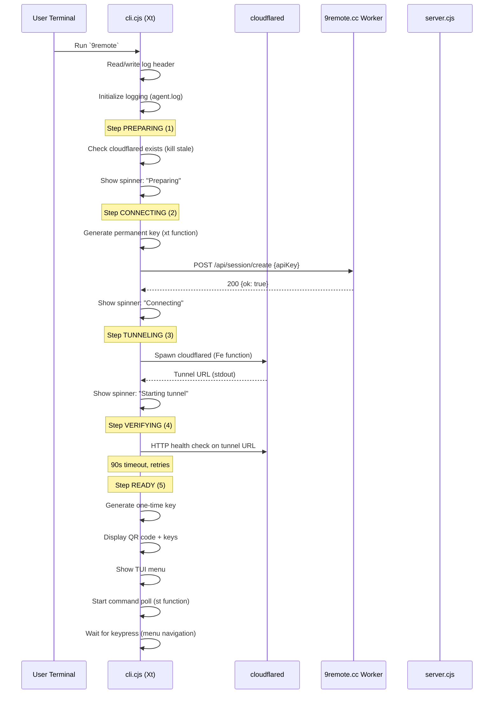
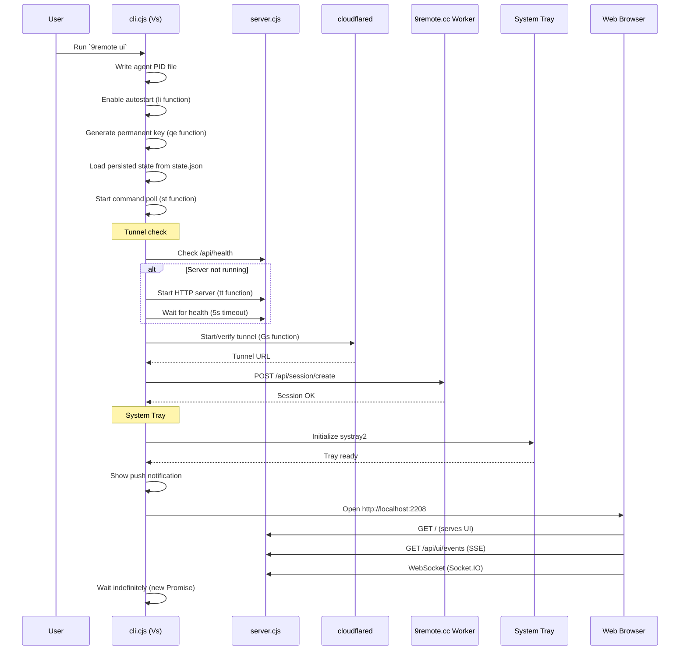
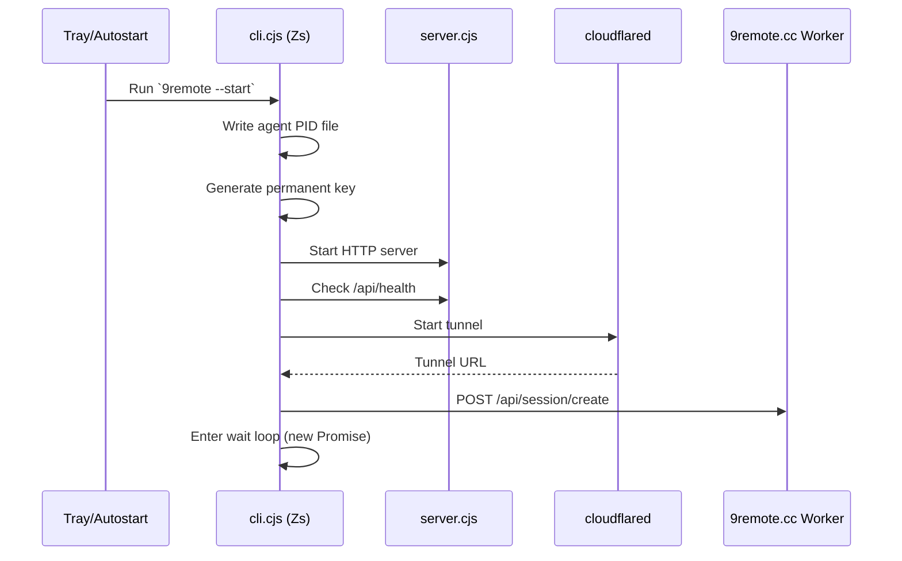

# Application Startup Flow

> **Purpose:** Detailed sequence of how 9Remote starts up in different modes.
> **Scope:** CLI entry point through to server/tunnel readiness.
> **Source:** `package/dist/cli.cjs` (main entry, `Xt()`, `Vs()`, `Zs()`)

## 1. Overview

9Remote has three startup paths, determined by CLI arguments and flags:

| Mode | Command | Entry Function | Description |
|------|--------|---------------|-------------|
| TUI Mode | `9remote` (no args) | `Xt()` | Interactive terminal UI with QR code |
| Web UI Mode | `9remote ui` | `Vs()` | Starts HTTP server, opens browser dashboard |
| Background Mode | `9remote --start` | `Zs()` or `sl()` | Headless server for tray/autostart |

## 2. TUI Mode Startup Flow

```
┌─────────────────────────────────────────────────────────────┐
│  Terminal: 9remote                                            │
│                                                             │
│  Step 1: Preparing                                          │
│  - Check cloudflared binary exists                          │
│  - Verify dependencies                                      │
│                                                             │
│  Step 2: Connecting                                         │
│  - Generate permanent key (machine ID + salt)              │
│  - POST to https://9remote.cc/api/session/create           │
│  - Verify session created                                  │
│                                                             │
│  Step 3: Tunneling                                          │
│  - Spawn cloudflared tunnel                                │
│  - Wait for tunnel URL (90s timeout)                       │
│                                                             │
│  Step 4: Verifying                                          │
│  - HTTP health check on tunnel URL                         │
│                                                             │
│  Step 5: Ready                                              │
│  - Display QR code + one-time key                          │
│  - Wait for device connection                              │
│  - Show interactive menu                                   │
│                                                             │
│  Menu options:                                              │
│  [K] Keys      [D] Desktop     [V] Devices                 │
│  [S] Settings  [L] Logs        [U] Update                  │
└─────────────────────────────────────────────────────────────┘
```

### Detailed Sequence



## 3. Web UI Mode Startup Flow

```
┌─────────────────────────────────────────────────────────────────────┐
│  Terminal: 9remote ui                                               │
│                                                                     │
│  1. Generate permanent key                                          │
│  2. Start HTTP server (port 2208)                                   │
│  3. Load persisted state (state.json)                              │
│  4. Start system tray (systray2)                                    │
│  5. Show notification: "9Remote is running"                        │
│  6. Open browser to http://localhost:2208                          │
│  7. Display QR code in browser                                     │
│  8. Wait for --start flag or exit                                  │
└─────────────────────────────────────────────────────────────────────┘
```

### Detailed Sequence



## 4. Background Mode Startup Flow (`--start` flag)

Background mode is used for autostart and tray-launched operation.



## 5. First Run Detection

On **every** startup, the CLI:

1. **Checks for existing state:** Reads `~/.9remote/keys.json`
   - If exists and valid → load permanent key
   - If missing → generate new permanent key from machine ID

2. **Checks for cloudflared:** Verifies `cloudflared` binary is available
   - Auto-downloads on first run if missing (handled by `In()` function)
   - Verifies SHA256 checksum of downloaded binary

3. **Checks for systray2:** Post-install script (`install.cjs`) installs systray2
   - Installed in `~/.9remote/runtime/node_modules/systray2/`
   - If missing, disabled gracefully (tray not available)

4. **Checks for robotjs:** Verifies remote desktop support
   - If `@hurdlegroup/robotjs` is installed → desktop available
   - If missing → remote desktop feature disabled

## 6. Port Configuration

| Component | Default Port | Override |
|-----------|-------------|----------|
| HTTP Server | 2208 | `PORT` env var |
| Vite Dev Server | 5173 | `vite.config.js` |
| PtyDaemon socket | (Unix socket) | N/A |

## 7. Error Paths

### Server not running at startup
- In UI mode, CLI starts the server if `/api/health` fails
- Background mode waits up to 15s for server to be ready

### cloudflared not found
- CLI attempts to download and cache the binary
- If download fails, QR is shown with tunnel URL as empty (RTC-only mode)
- Background retry every ~2 minutes with exponential backoff

### Session creation fails
- CLI retries up to 3 times with exponential backoff (base 1s, max 60s)
- After failure, shows error and exits TUI

### Port already in use
- Error message: "Port 2208 already in use"
- Suggested fix: `pkill -f 9remote` or use `PORT=3308 9remote`
