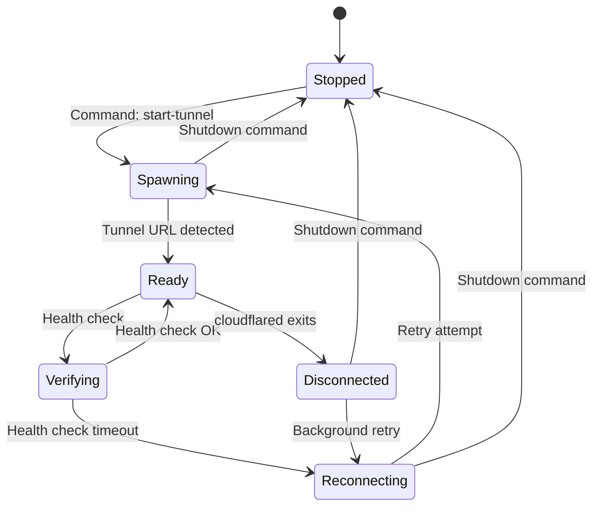
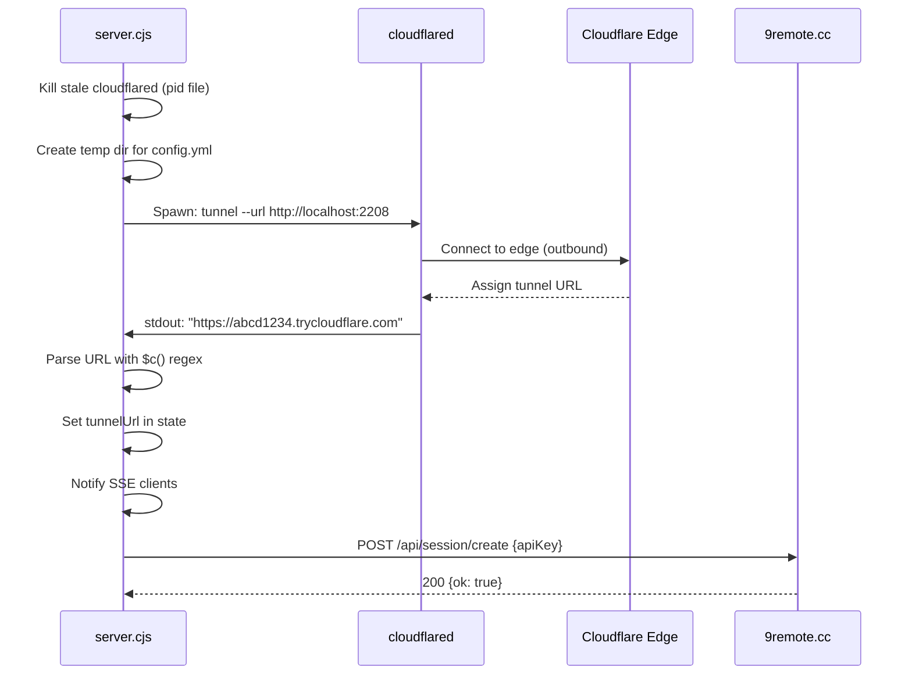
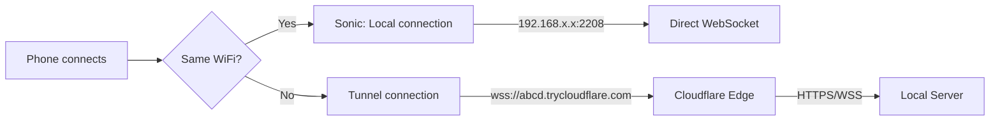

# Cloudflare Tunnel Lifecycle

> **Purpose:** Document the full lifecycle of the Cloudflare tunnel in 9Remote.
> **Scope:** cloudflared spawn, URL rotation, health checks, auto-restart, sleep/wake recovery.
> **Source:** `package/dist/cli.cjs` (Fe spawn, Gs startup, Ks cleanup functions). Note: Some referenced functions (rt, Zt, Bt, Sc, Et, kn, Mc, jt, gt, In) are defined in `server.cjs` or bundled modules. The fetch wrapper is `Z()` (aliased as `G` in call sites); the config object is `Ct`; `xe()` returns the binary directory path, not a config object.

## 1. Overview

9Remote uses **Cloudflare Quick Tunnel** (`cloudflared tunnel`) to establish a secure, outbound-only connection to Cloudflare's edge network. This eliminates the need for port forwarding, firewall configuration, or VPN setup.

The tunnel lifecycle is managed by the server process and involves:
1. Spawning `cloudflared` as a child process
2. Parsing tunnel URLs from stdout/stderr
3. Health-checking the tunnel
4. Monitoring for network changes and sleep/wake cycles
5. Auto-restarting when needed

## 2. Tunnel Configuration

### Spawn Command

```bash
cloudflared tunnel \
  --url http://localhost:2208 \
  --config <tmpdir>/config.yml \
  --no-autoupdate \
  --protocol http2
```

Config file (`config.yml`):
```yaml
# quick-tunnel
```

### Environment

- `cloudflared` binary is auto-downloaded on first run
- Binary location: cached in system PATH or user's home directory
- `--no-autoupdate` prevents cloudflared from self-updating
- `--protocol http2` forces HTTP/2 for better performance

## 3. Lifecycle States



## 4. Detailed Flow

### 4.1 Spawn (Fe function)



### 4.2 URL Rotation

Cloudflare may rotate the tunnel URL periodically. The server detects this:

```javascript
// URL change handler (onUrlUpdate callback)
const onUrlUpdate = (newUrl) => {
  // newUrl !== previousUrl
  logger.info(`URL rotated: ${newUrl}`);
  setState({ tunnelUrl: newUrl });
  emitSSE('state', { tunnelUrl: newUrl });
  // Send to Cloudflare worker for session update
};
```

### 4.3 Health Check (rt function)

After tunnel URL is detected, the server performs a health check:

```javascript
// Health check: GET tunnelUrl/api/health
// Timeout: 5 seconds
// If OK → tunnel is verified, state = READY
// If timeout → tunnel is set to empty, bg reconnect
```

### 4.4 Auto-Restart Logic (ve function / ae config)

The server has a comprehensive retry/restart system with exponential backoff:

| Config | Strategy | Base (ms) | Max (ms) |
|--------|----------|-----------|----------|
| `tunnelRestart` | exponential | 2,000 | 300,000 (5 min) |
| `tunnelSpawn` | linear | 5,000 | 60,000 |
| `tunnelRateLimit` | exponential | 60,000 | 900,000 (15 min) |
| `edgeProbe` | — | — | — |

**Rate limiting:** After 10 failed tunnel spawns within a window, the system enters a rate-limited state that suppresses restarts for up to 15 minutes.

### 4.5 Network Change Detection

The server monitors for network changes (every 2 seconds):

```javascript
// Nc() function - network change detector
setInterval(async () => {
  const currentIP = getLocalIP(); // qi() function
  if (currentIP !== previousIP && cloudflaredRunning) {
    logger.info('Network change detected');
    // Check if cloudflared is alive
    // If alive but edge probe fails → restart tunnel
    // If cloudflared dead → spawn new tunnel
  }
}, 2000);
```

### 4.6 Sleep/Wake Detection

The server detects system sleep/wake cycles:

```javascript
// Sleep detection via time gap
// If gap > Rc (threshold) between checks → sleep/wake detected
if (sleepDetected) {
  logger.info(`Sleep/wake detected (gap=${gapMs}ms)`);
  if (tunnelResponsive) {
    // Retry health check 3 times with 3s delays
  } else {
    // Tunnel unresponsive → restart
    tunnelManager.restart();
  }
}
```

### 4.7 Edge Probe

Periodically checks if the tunnel has active connections at the Cloudflare edge:

```javascript
// Runs when: tunnelUrl set AND gap > edgeProbeIntervalMs (30s)
// AND consecutive check count >= edgeProbeFailureThreshold (3)
const activeConns = edgeProbe(tunnelUrl);
if (activeConns === 0) {
  // Edge has no connections → tunnel lost → restart
  tunnelManager.restart();
}
```

## 5. LocalFirstAdapter

When the phone and host are on the same network, 9Remote prefers local connections:



The `LocalFirstAdapter` races both connection methods and uses whichever responds first.

## 6. Tunnel Commands (Command File)

The TUI menu communicates with the server via a command file (`~/.9remote/state/cmd.json`):

| Command | Action |
|---------|--------|
| `start-tunnel` | Start the Cloudflare tunnel |
| `stop-tunnel` | Stop the tunnel, clear tunnelUrl |
| `restart-tunnel` | Stop then start |
| `regenerate-key` | Generate a new one-time key |
| `shutdown` | Stop tunnel + exit server |
| `update` | Trigger update flow |
| `restart` | Restart the agent process |

The server polls this file every 1 second (`ye.cmdMs = 1000`).

## 7. Verification Notes

The following were verified against `package/dist/cli.cjs`:

### 7.1 Fetch Wrapper

The documentation references `G()` as the fetch wrapper function. Code verification shows:
- **Actual function:** `Z(e, n)` performs `POST http://{host}:{port}{e}` with JSON body
- **`G` is called** at the call site `await G(`${C}/api/session/create`, ...)` but **`G` is not defined** in `cli.cjs` — it is either an alias for `Z` or defined in another bundled module
- **`V(e)`** is the GET fetch wrapper (`fetch(http://${r}:${_}${e})`)
- Both `G` and `Z` may refer to the same conceptual function across different code paths

### 7.2 Config Object

The documentation references `xe()` as the config object. Code verification shows:
- **`xe()`** returns the CLI binary directory path (via `path.dirname(fileURLToPath(__importMetaUrl))`)
- **Actual config object:** `Ct` (defined at line 74 of `cli.cjs`)
  ```javascript
  var Ct = {checkIntervalMs: 36e5, connectCheckDebounceMs: 9e5, maxRetry: 3, retryDelayMs: 3e3, verifyTimeoutMs: 15e3, lockTtlMs: 3e5, lockFile: "update.lock"}
  ```

### 7.3 Reconnect Functions

Several functions referenced in the documentation (`rt`, `Zt`, `Bt`, `Sc`, `Et`, `kn`, `Mc`, `jt`, `gt`, `In`, `je`) are **called in `cli.cjs`** but **not defined there**. They are defined in `server.cjs` or other bundled modules. Key functions and their actual locations:

| Function | Actual Location | Purpose |
|----------|----------------|---------|
| `rt()` | `server.cjs` or bundled | Tunnel health check (HTTP GET to tunnelUrl/api/health) |
| `Bt()` | `server.cjs` or bundled | Edge probe (active connection count) |
| `Sc()` | `server.cjs` or bundled | Connection count check helper for edge probe |
| `Et()` | `server.cjs` or bundled | Session/tunnel URL registration callback |
| `kn()` | `server.cjs` or bundled | Event logger (unreachable state) |
| `Mc()` | `server.cjs` or bundled | Timeout clearer for tunnel operations |
| `jt()` | `server.cjs` or bundled | Queue/job tracker for tunnel state updates |
| `gt()` | `server.cjs` or bundled | Event logger for tunnel errors |
| `In()` | bundled | cloudflared downloader (binary fetch + cache) |
| `je()` | `server.cjs` or bundled | Reconnect retry factory (creates retry wrapper with backoff) |
