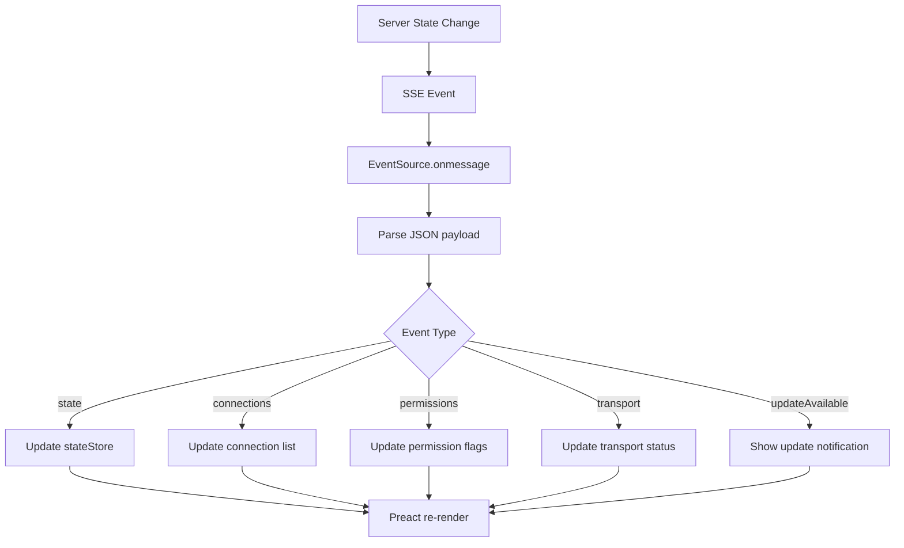
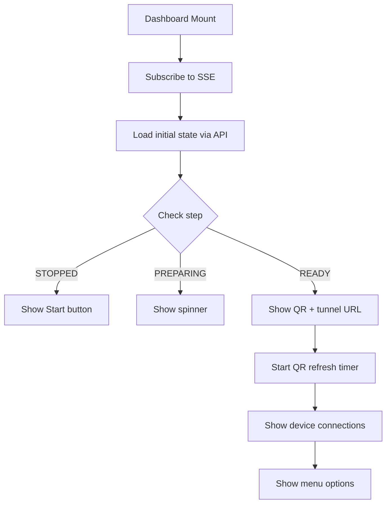
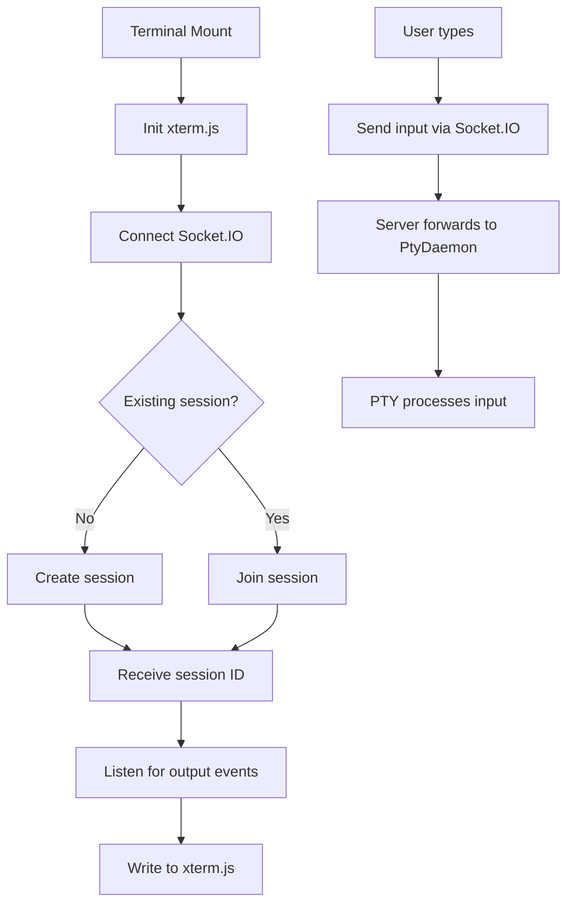
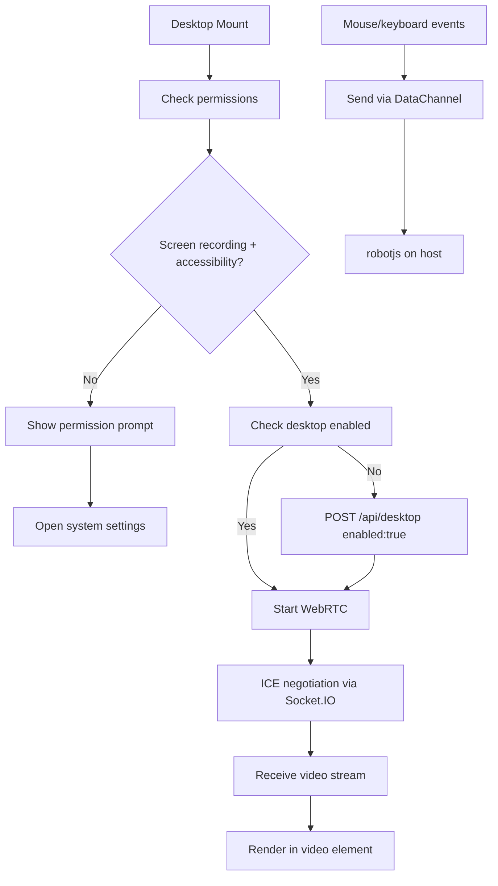
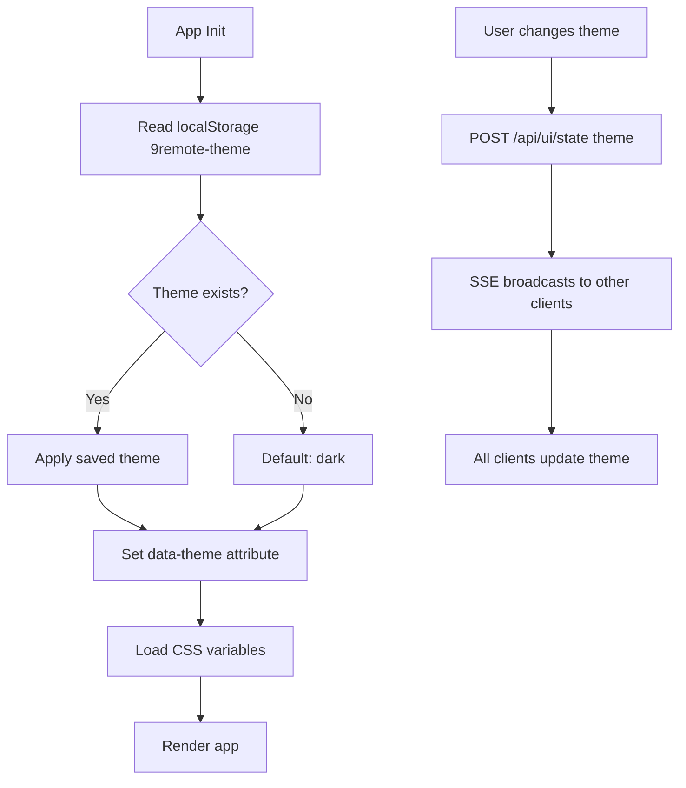

# Web UI Lifecycle and State Management

> **Purpose:** Document the lifecycle of the 9Remote web UI and its state management.
> **Scope:** Preact SPA, state synchronization, real-time updates.
> **Source:** `package/dist/ui/index.html`, `package/dist/ui/assets/index-H_1CAVCP.js`, `package/dist/server.cjs`

## 1. Overview

The 9Remote web UI is a **Preact single-page application (SPA)** that serves as the embedded dashboard when running `9remote ui`. It's built with Vite, uses Tailwind CSS for styling, and communicates with the server via:
- **SSE** for real-time state broadcasting (`/api/ui/events`)
- **Socket.IO** for terminal I/O and control
- **HTTP API** for state management

The UI is also accessible remotely via the Cloudflare tunnel from any browser or mobile device.

## 2. UI Architecture

```
┌─────────────────────────────────────────────────────────┐
│  9Remote Web UI (Preact SPA)                              │
│                                                           │
│  ┌─────────────────────────────────────────────────────┐ │
│  │  Root App (index-H_1CAVCP.js)                       │ │
│  └─────────────────────────────────────────────────────┘ │
│                                                           │
│  ├── Router (client-side)                                 │
│  │   ├── /                              → Dashboard     │
│  │   ├── /terminal/:sessionId           → Terminal      │
│  │   ├── /files                        → File Explorer   │
│  │   ├── /editor/:filename             → Code Editor     │
│  │   ├── /git                          → Git Panel       │
│  │   ├── /desktop                      → Remote Desktop  │
│  │   ├── /devices                      → Device Manager  │
│  │   ├── /settings                     → Settings        │
│  │   ├── /logs                         → Logs Viewer     │
│  │   └── /login?k={key}                → Pair Device     │
│  │                                                         │
│  ├── Components                                            │
│  │   ├── TerminalView (xterm.js)                          │
│  │   ├── DesktopView (WebRTC video)                       │
│  │   ├── FileExplorer (tree/grid view)                    │
│  │   ├── CodeEditor (syntax highlight)                    │
│  │   ├── GitPanel                                         │
│  │   ├── DeviceManager (Pair Device list)                 │
│  │   ├── SettingsPanel                                     │
│  │   ├── QRScanner (camera or paste)                      │
│  │   ├── NotificationToast                                │
│  │   └── AIIntegration (agent icons)                      │
│  │                                                         │
│  ├── State Management                                      │
│  │   ├── stateStore (UI state via SSE)                    │
│  │   ├── terminalStore (Socket.IO sessions)               │
│  │   ├── deviceStore (Pair Device status)                 │
│  │   └── settingsStore (theme, preferences)                 │
│  │                                                         │
│  └── Communication Layers                                   │
│      ├── SSE: EventSource (/api/ui/events)                │
│      ├── Socket.IO: io()                                  │
│      ├── HTTP API: fetch()                                │
│      └── WebRTC: RTCPeerConnection (desktop only)         │
└─────────────────────────────────────────────────────────┘
```

## 3. State Management

### 3.1 State Sources

The UI receives state from three channels:

| Channel | Frequency | Data |
|---------|-----------|------|
| **SSE** | On change | Persistent state: step, tunnelUrl, keys, theme, connections, permissions, transport |
| **Socket.IO** | Real-time | Terminal output, session events, desktop frames |
| **HTTP API** | On-demand | Current state, logs, device list |

### 3.2 State Shape

The UI state is synchronized via SSE events. The state object shape:

```typescript
interface UIState {
  // Connection state
  step: number;              // 0=STOPPED, 1=PREPARING, 2=CONNECTING, 3=TUNNELING, 4=VERIFYING, 5=READY
  stepDesc: string;          // Human-readable description
  tunnelUrl: string;         // Cloudflare tunnel URL (empty if down)
  
  // Keys
  permanentKey: string;      // Machine-derived permanent key
  oneTimeKey: string;        // Temporary 30-min key for QR login
  oneTimeKeyExpiresAt: string; // ISO timestamp
  
  // UI settings
  theme: 'dark' | 'light';   // Current theme
  
  // Tunnel management
  tunnelRetry: {
    attempt: number;
    delay: number;
    at: number;
  } | null;
  
  // QR
  qrUrl: string;             // Full URL for QR code
  
  // Derived state
  connections: Connection[];  // Active device connections
  permissions: {
    screenRecording: boolean;
    accessibility: boolean;
    desktopEnabled: boolean;
  };
  transport: {
    signaling: 'connected' | 'connecting' | 'off';
    rtcDisabled: boolean;
    remoteAvailable: boolean;
  };
}
```

### 3.3 State Update Flow



## 4. Component Lifecycle

### 4.1 Dashboard Component



### 4.2 Terminal Component



### 4.3 Desktop Component



## 5. Theme Management



## 6. Mobile Responsiveness

The UI adapts to mobile devices:

- **Viewport:** `<meta name="viewport" content="width=device-width, initial-scale=1.0">`
- **Touch controls:** Gesture support for terminal (pinch to zoom, swipe)
- **QR scanner:** Camera access for scanning QR codes from the host
- **File picker:** Native file input for upload/download
- **Connection management:** Device list optimized for touch

## 7. Build & Deployment

### Development
```bash
# Terminal 1: Start server
npm run dev:ui:run

# Terminal 2: Start Vite dev server (with proxy)
npm run dev
```

The dev setup uses `wait-on` to ensure the server is ready before starting Vite, and Vite proxies API calls to `localhost:2208`.

### Production Build
```bash
npm run build:ui    # Vite build → ui/assets/index-*.{js,css}
```

Built assets:
- `ui/assets/index-CcS6AXZF.css` — Tailwind CSS bundle
- `ui/assets/index-H_1CAVCP.js` — Preact SPA bundle (obfuscated in production)

### Serving
- The server serves static files from the `ui/` directory
- `index.html` is served at `/` and `/ui/`
- Assets are served at `/ui/assets/`
