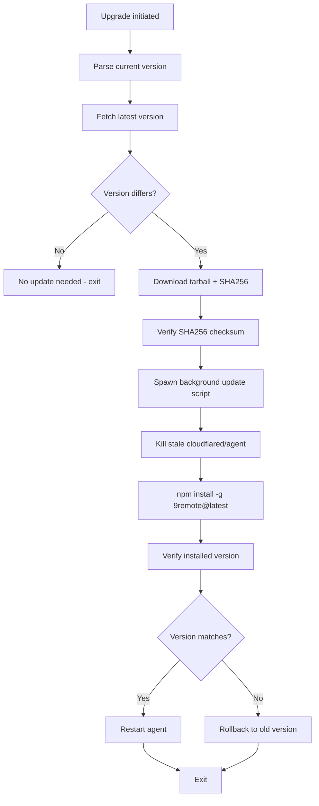

# Application Upgrade Flow

> **Purpose:** Document the complete update/upgrade flow for 9Remote.
> **Scope:** Version checking, download, verification, installation, and rollback.
> **Source:** `package/dist/cli.cjs` (Ei, fc, yi, wi, sc functions)

## 1. Overview

9Remote has a self-update mechanism that:
1. Checks the npm registry for the latest version
2. Downloads and verifies the new package (SHA256 integrity)
3. Spawns a background process to install the update
4. Restarts the agent after successful installation
5. Rolls back if the new version is broken

## 2. Upgrade Process Diagram



## 3. Detailed Steps

### 3.1 Version Check (yi function)

```javascript
// Fetches latest version from npm registry
const registry = process.env.NREMOTE_REGISTRY || 'https://registry.npmjs.org/9remote/latest';
const response = await fetch(registry);
const { version } = await response.json();
```

- **Registry URL:** Configurable via `NREMOTE_REGISTRY` env var
- **Default:** `https://registry.npmjs.org/9remote/latest`
- **Cache:** Version is checked on startup and via SSE `updateAvailable` event

### 3.2 Download & Verification (sc function)

```javascript
// Downloads tarball and SHASUMS256.txt
// Verifies SHA256 checksum of the downloaded package
const tarballs = manifest.filter(t => t.endsWith('.tgz'));
const shas = manifest.filter(s => s.includes('SHASUMS256'));
```

The verification step:
1. Downloads `SHASUMS256.txt` from npm
2. Finds the entry for the latest version's `.tgz` file
3. Computes SHA256 of downloaded tarball
4. If mismatch → throw `Integrity check failed`

### 3.3 Integrity Check (wc function)

```javascript
// wc(tarballPath, shasContent)
const expectedHash = shasContent.match(tarballPath).split(/\s+/)[0];
const actualHash = createHash('sha256').update(readFileSync(tarballPath)).digest('hex');
if (actualHash !== expectedHash) {
  throw new Error('Integrity check failed: SHA256 mismatch');
}
```

## 4. Background Update Script (fc function)

### 4.1 Linux/macOS Script (shell)

```bash
#!/bin/bash
# Wait for agent to exit so it releases the cli.cjs file lock
while kill -0 $AGENT_PID 2>/dev/null; do sleep 1; done

# Kill tracked PIDs only (never ptyDaemon → sessions survive)
for name in cloudflared agent; do
  f="$STATE_DIR/${name}.pid"
  if [ -f "$f" ]; then
    pid=$(cat "$f" 2>/dev/null)
    [ -n "$pid" ] && kill -9 "$pid" 2>/dev/null || true
    rm -f "$f"
  fi
done
lsof -ti:2208 | xargs kill -9 2>/dev/null || true
sleep 2

# Retry install loop
attempt=0
while [ $attempt -lt 3 ]; do
  attempt=$((attempt+1))
  echo "Installing (attempt $attempt)..."
  if npm install -g 9remote@latest; then break; fi
  if [ $attempt -eq 3 ]; then
    npm install -g 9remote@latest --omit=optional || true
  fi
  sleep 3
done

# Verify version
NEWVER=$(node "$NODE_PATH" "$CLI_PATH" --version 2>/dev/null | head -1 | sed 's/\x1B[[0-9;?]*[a-zA-Z]//g' | tr -d '[:space:]')
if [ "$NEWVER" != "$LATEST_VERSION" ]; then
  echo "Verify failed (got $NEWVER, want $LATEST_VERSION), rolling back..."
  npm install -g 9remote@$CURRENT_VERSION || true
fi

rm -f "$LOCK_FILE"
node "$NODE_PATH" "$CLI_PATH" --tray --skip-update --start
```

### 4.2 Windows Script (bash → cmd)

Uses a `.bat` file with `taskkill` and a `.vbs` wrapper for background execution:

```batch
tasklist /FI "PID eq %AGENT_PID%" 2>nul | find "%AGENT_PID%" >nul
if not errorlevel 1 (
  timeout /t 1 /nobreak >nul
  goto waitloop
)

for %%N in (cloudflared agent) do (
  if exist "%STATE_DIR%\%%N.pid" (
    for /f %%P in ('type "%STATE_DIR%\%%N.pid"') do taskkill /F /T /PID %%P >nul 2>&1
    del /f /q "%STATE_DIR%\%%N.pid" >nul 2>&1
  )
)
for /f "tokens=5" %%a in ('netstat -aon ^| findstr :2208') do taskkill /F /PID %%a >nul 2>&1
timeout /t 3 /nobreak >nul

REM Install loop (3 retries)
set /a ATTEMPT=0
:installloop
set /a ATTEMPT+=1
call npm install -g 9remote@latest >nul 2>&1
if !ERRORLEVEL! EQU 0 goto verify
if !ATTEMPT! GEQ 3 (
  call npm install -g 9remote@latest --omit=optional >nul 2>&1
  goto verify
)
timeout /t 3 /nobreak >nul
goto installloop

:verify
REM Read installed version
"%NODE%" "%CLI%" --version > "%VERFILE%" 2>nul
for /f "usebackq tokens=* delims= " %%V in ("%VERFILE%") do (
  set "NEWVER=%%V"
  goto :gotver
)
:gotver
del /f /q "%VERFILE%" >nul 2>&1
if defined NEWVER set "NEWVER=!NEWVER: =!"
if not "!NEWVER!"=="%LATEST_VERSION%" (
  call npm install -g 9remote@%CURRENT_VERSION% >nul 2>&1
)

del /f /q "%LOCK_FILE%"

REM Restart
wscript "%VBSCRIPT%"
exit /b 0
```

The VBS wrapper:
```vbs
CreateObject("WScript.Shell").Run "cmd /c ""%TEMP%\9remote-update.bat""", 0, False
```

## 5. Upgrade Eligibility Check (hm function)

Before starting an upgrade, the system checks several conditions:

1. **Platform support:** Only `darwin` (macOS), `win32` (Windows), and `linux` are supported
2. **Worker connectivity:** Must be able to reach `9remote.cc` worker
3. **Build integrity:** Verifies the npm package tarball SHA256
4. **Task registration:** On Windows, registers a UAC-elevated task for installation
5. **Worker liveness:** Checks if a previous update worker is still running

## 6. Post-Upgrade

After a successful update:

- The background script restarts the agent with: `9remote --tray --skip-update --start`
- `--skip-update` prevents an immediate re-check loop
- `--start` launches in background mode (headless, with tray)

## 7. Update Detection for Clients

The server notifies connected clients of available updates via SSE:

```
data: { "type": "updateAvailable", "version": "2.5.9", ... }
```

The web UI can display this as a notification and offer to trigger the update flow via `POST /api/update`.
