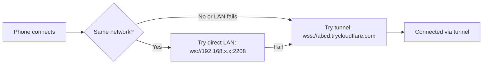

# Cloudflare Tunnel Integration

> **Purpose:** Document the Cloudflare Tunnel (cloudflared) integration in 9Remote.
> **Scope:** cloudflared configuration, tunnel management, and edge connectivity.
> **Source:** `package/dist/cli.cjs`, `package/dist/server.cjs`

## 1. Overview

9Remote uses **Cloudflare Quick Tunnel** to establish secure, outbound-only connections to Cloudflare's global edge network. This eliminates the need for:

- Port forwarding on the router
- Firewall configuration
- Static IP addresses
- VPN setup
- Reverse proxy configuration

### Key Benefits

| Benefit | How It Works |
|---------|-------------|
| No port forwarding | cloudflared makes an outbound HTTPS connection |
| Auto-assign URL | Cloudflare assigns a random `*.trycloudflare.com` URL |
| TLS termination | Cloudflare handles TLS; local traffic is plaintext |
| Global edge | Cloudflare's 300+ data centers provide worldwide connectivity |
| Anycast routing | Traffic routes to the nearest Cloudflare PoP |

## 2. cloudflared Configuration

### Spawn Command

```bash
cloudflared tunnel \
  --url http://localhost:2208 \
  --config <tmpdir>/config.yml \
  --no-autoupdate \
  --protocol http2
```

### Config File

Written to a temporary directory at startup:
```yaml
# quick-tunnel
```

The `--no-autoupdate` flag prevents cloudflared from self-updating (9Remote manages updates).
The `--protocol http2` flag enforces HTTP/2 for better multiplexing.

### Binary Management

| Platform | Location | Notes |
|----------|----------|-------|
| macOS | Auto-downloaded to system PATH | Cached in `~/.9remote/runtime/` |
| Linux | Auto-downloaded to system PATH | |
| Windows | Auto-downloaded to system PATH | |

The binary is downloaded on first run if not found. SHA256 checksums are verified during download.

## 3. Tunnel Lifecycle Management

### 3.1 Spawn

The tunnel is spawned by the `Fe()` function in `cli.cjs`:

```javascript
function Fe(port, onUrl, onError, onExit) {
  // 1. Kill stale cloudflared (from PID file)
  // 2. Create temp dir + config.yml
  // 3. Spawn: cloudflared tunnel --url http://localhost:${port} ...
  // 4. Listen on stdout/stderr for tunnel URL
  // 5. Parse URL with regex: /https:\/\/([a-z0-9-]+)\.trycloudflare\.com/gi
}
```

**Spawn options:**
- `detached: false` (macOS/Linux) / `detached: false` (Windows)
- `windowsHide: true`
- `stdio: ["ignore", "pipe", "pipe"]` (stdout/stderr captured)

### 3.2 URL Detection

The server parses cloudflared's stdout/stderr output for the tunnel URL:

```javascript
// URL extraction regex
const URL_REGEX = /https:\/\/([a-z0-9-]+)\.trycloudflare\.com/gi;

// Only non-"api" subdomains are accepted
const extractTunnelUrl = (output) => {
  const matches = [...output.matchAll(URL_REGEX)];
  const validUrls = matches.filter(m => m[1] !== 'api');
  return validUrls.length ? validUrls[validUrls.length - 1][0] : null;
};
```

### 3.3 URL Rotation

Cloudflare may rotate the tunnel URL periodically. The server:

1. Detects URL changes from cloudflared output
2. Calls the `onUrl` callback with the new URL
3. Updates `tunnelUrl` in the server state
4. Broadcasts the change via SSE to connected clients
5. Updates the Cloudflare Worker session (if applicable)

### 3.4 Health Check

After URL detection, the server performs an HTTP health check:

```javascript
// rt(tunnelUrl) function
async function healthCheck(url) {
  try {
    const res = await fetch(`${url}/api/health`, { timeout: 5000 });
    return res.ok;
  } catch {
    return false;
  }
}
```

- **Timeout:** 5 seconds
- **Endpoint:** `/api/health` on the tunnel URL
- If the check fails, the tunnel is set to empty state and a background reconnect is scheduled

## 4. Tunnel Monitoring & Auto-Restart

### 4.1 Network Change Detection

The server monitors for network changes every 2 seconds:

```javascript
// Nc() function — runs in setInterval
setInterval(async () => {
  // 1. Get current local IPs
  const currentIP = getLocalIP(); // qi() function
  
  // 2. Compare with previous
  const networkChanged = currentIP !== previousIP;
  
  // 3. Check if cloudflared is alive
  const tunnelAlive = checkProcess(cloudflaredPid);
  
  // 4. If network changed and tunnel alive → edge probe
  // If tunnel dead → spawn new tunnel
}, 2000);
```

### 4.2 Sleep/Wake Detection

| Gap Duration | Action |
|---|---|
| > 2 minutes | Sleep/wake detected → health check + potential restart |
| < 2 minutes | Ignored (normal network fluctuation) |

On sleep/wake:
1. Three health check retries (3s delay each)
2. If tunnel doesn't recover → restart
3. If tunnel recovers → continue monitoring

### 4.3 Edge Probe

Every 30 seconds (when tunnel URL is set and no recent network change):

```javascript
// Check if Cloudflare edge has active connections
const activeConns = await edgeProbe(tunnelUrl);
// Uses: lsof/netstat to count cloudflared ESTABLISHED connections
if (activeConns === 0 && consecutiveFailures >= 3) {
  // Tunnel lost → restart
  restartTunnel();
}
```

### 4.4 Auto-Restart Policy

| Condition | Action | Backoff |
|-----------|--------|---------|
| cloudflared exits (non-intentional) | Re-spawn | Linear: 5s × attempt (max 60s) |
| Health check timeout | Clear tunnel URL, background retry | Exponential: 2s × 2^attempt (max 5min) |
| Edge probe failure (3 consecutive) | Full tunnel restart | Rate-limited: 60s × 2^attempt (max 15min) |
| URL rotation | Update state | No backoff |
| Network change detected | Health check + restart if needed | Depends on condition |

## 5. LocalFirstAdapter

### 5.1 Principle

The LocalFirstAdapter tries to connect directly over LAN first, falling back to the Cloudflare tunnel:



### 5.2 Network Detection

```javascript
// Local IP detection (qi function)
function getLocalIP() {
  const interfaces = os.networkInterfaces();
  // Exclude virtual interfaces: utun, awdl, llw, anpi, bridge, gif, stf, etc.
  // Return first non-internal IPv4
}
```

### 5.3 Connection Racing

When a client connects, the server:
1. Checks if the connecting IP is local (127.0.0.1, ::1) or has CF-Connecting-IP header
2. If local, allows direct connection
3. The client's web app attempts both LAN and tunnel connections, using whichever succeeds first

## 6. Tunnel URL Usage

The tunnel URL is used for:
1. **Server API** — Serving the embedded dashboard and accepting Socket.IO connections
2. **QR Code** — Displaying the URL on the host for QR scanning
3. **Worker Registration** — POST to `/api/session/create` (on 9remote.cc)
4. **Health Checks** — Verifying tunnel connectivity
5. **SSE/SSE** — Broadcasting tunnel URL to connected web clients

## 7. Configuration

### Environment Variables

| Variable | Default | Description |
|----------|---------|-------------|
| `NREMOTE_WORKER_URL` | `https://9remote.cc` | Worker URL for session creation |
| `PORT` | `2208` | Local server port (tunnel connects to this) |

### Command-Line Flags

The `cloudflared` process is spawned with these flags:
- `--url http://localhost:{PORT}`
- `--config {tmpdir}/config.yml`
- `--no-autoupdate`
- `--protocol http2`
