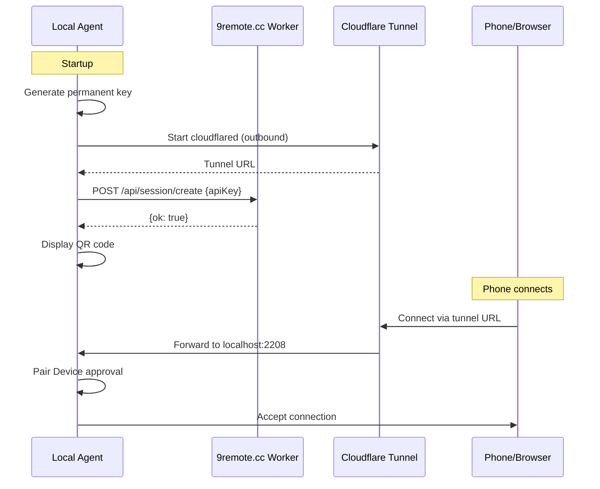

# Cloudflare Worker API

> **Purpose:** Document the Cloudflare Worker API at 9remote.cc.
> **Scope:** Session management, TURN credentials, and static file serving.
> **Source:** `README.md`, `package/dist/cli.cjs` (references to `9remote.cc` API)

## 1. Overview

The **9Remote Cloudflare Worker** (`https://9remote.cc`) is a lightweight, stateless edge function that coordinates between the local agent and the web client. It handles:

1. **Session Creation** — Validates API keys and creates sessions
2. **TURN Credentials** — Provides WebRTC TURN server credentials for desktop streaming
3. **Static File Serving** — Serves the web client (Next.js app) or redirects to CDN
4. **Login Redirect** — Serves the device pairing page

The worker is deployed on **Cloudflare Workers** and is designed to be lightweight and stateless. It does not store any sensitive data.

## 2. Endpoints

### 2.1 Session Creation

#### `POST /api/session/create`

Validates the agent's permanent API key and creates a session entry in the Cloudflare Tunnel.

**Request:**
```
POST https://9remote.cc/api/session/create
Content-Type: application/json
```

```json
{
  "apiKey": "sk-9f3a2b1c-d4e5-f6a7b8c9d0e1f2"
}
```

**Response (200 OK):**
```json
{
  "ok": true,
  "apiKey": "sk-9f3a2b1c-d4e5-f6a7b8c9d0e1f2"
}
```

**Response (401 Unauthorized):**
```json
{
  "error": "Invalid API key",
  "ok": false
}
```

**Response (400 Bad Request):**
```json
{
  "error": "Missing API key",
  "ok": false
}
```

**Error Codes:**
| HTTP Status | Error | Description |
|-------------|-------|-------------|
| 400 | `Missing API key` | `apiKey` field not provided in request body |
| 401 | `Invalid API key` | API key format invalid or HMAC mismatch |
| 500 | `Worker error` | Internal server error |

### 2.2 TURN Credentials

#### `POST /api/turn-credentials`

Provides WebRTC TURN server credentials for relayed desktop streaming when direct P2P fails.

> **Note:** This endpoint may be handled by the worker or a separate TURN service. The local server may request these credentials and forward them to connected clients via Socket.IO signaling.

**Request:**
```
POST https://9remote.cc/api/turn-credentials
Content-Type: application/json
```

```json
{
  "apiKey": "sk-9f3a2b1c-d4e5-f6a7b8c9d0e1f2",
  "username": "device-id-or-session-id"
}
```

**Response (200 OK):**
```json
{
  "ok": true,
  "turn": {
    "urls": "turn:turn.9remote.cc:443",
    "username": "generated-username",
    "credential": "generated-password"
  }
}
```

### 2.3 Login / Pairing Page

#### `GET /login?k={oneTimeKey}`

Serves the device pairing page where a phone/web client enters the one-time key to connect.

**Query Parameters:**
| Parameter | Required | Description |
|-----------|----------|-------------|
| `k` | Yes | One-time key for pairing |

**Response:** HTML page with the web client application, pre-filled with the one-time key for connection.

### 2.4 Web Client

#### `GET /`

Serves the main web client application (Next.js SPA).

**Response:** HTML page with the 9Remote web client, which:
1. Connects to the tunnel URL via Socket.IO
2. Authenticates with the one-time key
3. Displays terminal, file explorer, code editor, desktop, and settings

### 2.5 Health Check

#### `GET /health` or `GET /api/health`

Returns the worker health status.

**Response (200):**
```json
{
  "ok": true,
  "status": "healthy",
  "version": "1.x.x"
}
```

## 3. Authentication

### 3.1 API Key Format

The API key (permanent key) format:
```
sk-{machineId8}-{random4}-{hmac6}
```

Where:
- `machineId8`: First 8 characters of SHA256(machineId + salt)
- `random4`: 4 random characters from `[a-z0-9]`
- `hmac6`: First 6 characters of HMAC-SHA256(apiKeySecret, machineId8 + random4)

**Default `apiKeySecret`:** `9remote-api-key-secret` (can be overridden via server env var)

### 3.2 One-Time Key Flow

1. CLI generates a one-time key with the same format but with 30-minute TTL
2. CLI displays QR code with URL `https://9remote.cc/login?k={oneTimeKey}`
3. Phone visits the URL
4. Web client authenticates using the one-time key
5. One-time key is consumed/invalidated after use

## 4. Worker Responsibilities

### 4.1 What the Worker Does

| Function | Description |
|----------|-------------|
| Session validation | Verifies the agent's permanent API key format and HMAC |
| Key distribution | Provides tunnel status to connecting clients |
| Static serving | Serves web client or redirects to CDN |
| TURN management | Optionally provides TURN credentials |
| Rate limiting | Prevents abuse (session creation rate limits) |

### 4.2 What the Worker Does NOT Do

| Function | Reason |
|----------|--------|
| Store terminal data | Privacy — no data collection |
| Store files | File operations happen locally |
| Store screen captures | Desktop streaming is P2P or via tunnel |
| Store authentication keys | Keys are ephemeral and validated locally |
| Relay traffic | Traffic goes through Cloudflare Tunnel, not through worker |

## 5. Integration with Cloudflare Tunnel

The worker and tunnel work together:



## 6. Self-Hosting the Worker

To deploy a custom worker, use the Cloudflare Worker CLI:

```bash
npm install -g wrangler
cd worker-repo
wrangler deploy
```

The worker must implement:
- `POST /api/session/create` — Validate API key, return success
- `GET /login?k={key}` — Serve pairing page or redirect
- `GET /*` — Serve web client static files
- `POST /api/turn-credentials` — Optional TURN credential endpoint

**Configuration:**
- Set `NREMOTE_WORKER_URL` env var on the agent to point to the custom worker
- The agent sends `POST /api/session/create` with `Content-Type: application/json`

## 7. Worker Error Handling

| Scenario | Agent Behavior |
|----------|----------------|
| Worker unreachable | Tunnel is displayed with RTC-only fallback, background retry |
| Session creation fails | CLI shows error, exits with code 1 |
| Invalid API key | Not possible (generated locally from machine ID) |
| Worker returns 5xx | Retry with exponential backoff, max 3 attempts |
